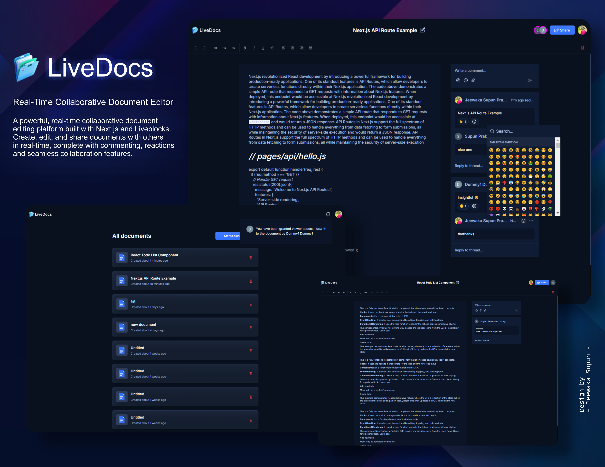

# LiveDocs - Real-Time Collaborative Document Editor

A powerful, real-time collaborative document editing platform built with Next.js and Liveblocks. Create, edit, and share documents with others in real-time, complete with commenting, reactions, and seamless collaboration features.

# Features

🔐 Secure Authentication

- User authentication and authorization
- Secure session management

📝 Real-Time Collaboration

- Multiple users can edit documents simultaneously
- See live cursors and selections from other users
- Real-time updates across all connected clients

📑 Document Management

- Create new documents
- List all your documents
- Delete documents you own
- Search and sort through your document library

🤝 Sharing & Permissions

- Share documents via email
- Set view or edit permissions for collaborators
- Manage access to your documents

💬 Rich Interactions

- Add inline comments to spark discussions
- React to content with a variety of emojis
- Thread conversations within comments

👥 Presence Awareness

- See who's currently viewing or editing
- Real-time presence indicators
- View collaborator actions in real-time

📱 Responsive Design

- Works seamlessly across desktop, tablet, and mobile devices

# Tech Stack

- Frontend: Next.js 14
- Real-Time Collaboration: Liveblocks
- UI Components: Lexical Editor, shadcn/ui
- Styling: Tailwind CSS
- Authentication: Clerk

# Getting Started

Prerequisites

- Node.js 18 or later
- npm or yarn
- A Liveblocks account
- A Clerk account

# Installation

1.Clone the repository
    
2.Install dependencies for both frontend and backend:

    # Install frontend dependencies
      - cd frontend
      - npm install
      
3.Set up environment variables:
     Create .env files in root directory with the necessary configuration (API keys)
     
      NEXT_PUBLIC_CLERK_PUBLISHABLE_KEY=
      CLERK_SECRET_KEY=

      NEXT_PUBLIC_CLERK_SIGN_IN_URL=/sign-in
      NEXT_PUBLIC_CLERK_SIGN_UP_URL=/sign-up

      LIVEBLOCKS_SECRET_KEY=
     
4.Start the development servers:

     # In a new terminal
        - cd frontend
        - npm run dev

5.Open your browser and navigate to http://localhost:3000 (or the port specified by Vite)

# Deployment

This project can be deployed to Vercel. Follow these steps to deploy:

- Push your code to a GitHub repository
- Sign up for a Vercel account if you haven't already
- Click the "New Project" button in your Vercel dashboard
- Import your GitHub repository
  
Configure the project:

- Vercel will automatically detect that it's a Next.js project
  
Add your environment variables:

- NEXT_PUBLIC_CLERK_PUBLISHABLE_KEY
- CLERK_SECRET_KEY
- LIVEBLOCKS_SECRET_KEY

Click "Deploy" - Your application will be built and deployed to a .vercel.app URL. You can then add a custom domain if desired.
  
Update your Clerk settings:

- Add your Vercel deployment URL to the allowed origins in your Clerk dashboard

Update your Liveblocks settings:

- Add your Vercel deployment URL to the allowed origins in your Liveblocks dashboard

# Contributing

Contributions are welcome! Please feel free to submit a Pull Request.

# License

This project is licensed under the MIT License - see the LICENSE file for details.

# Acknowledgments

- Built with Next.js
- Real-time collaboration powered by Liveblocks
- Authentication by Clerk
- UI components from shadcn/ui

## Let's Work Together

I'm always open to new opportunities and collaborations. Feel free to reach out!

- 📧 Email: supunprabodha789@gmail.com
- 🔗 LinkedIn: [ https://lk.linkedin.com/in/jeewaka-supun-221780218]

© 2024 [Jeewaka Supun] | Web Developer and UI Designer
